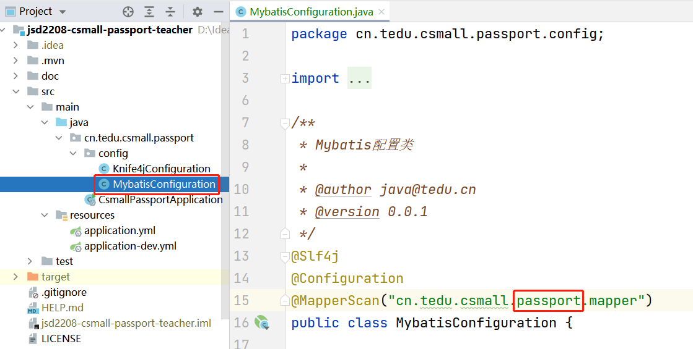

# 添加管理员--Mapper层

由于当前是开发新项目中的第1个功能，需要配置Mapper接口的包，所以，将原项目（`csmall-product`）项目中的`MybatisConfiguration`复制到新项目对应的包中，并修改`@MapperScan`注解配置的包名：



另外，还应该配置XML文件的位置，此项配置应该在复制过来的YML配置中已经存在了，不需要再次配置。

添加管理员的本质是向`ams_admin`表中插入数据，需要执行的SQL语句大致是：

```mysql
INSERT INTO ams_admin (除了id、gmt_create、gmt_modified以外的字段列表) VALUES (匹配的值列表)
```

需要先创建实体类，在项目的根包下创建`pojo.entity.Admin`类：

```java
package cn.tedu.csmall.passport.pojo.entity;

import lombok.Data;

import java.io.Serializable;
import java.time.LocalDateTime;

/**
 * 管理员的实体类
 *
 * @author java@tedu.cn
 * @version 0.0.1
 */
@Data
public class Admin implements Serializable {

    /**
     * 数据id
     */
    private Long id;

    /**
     * 用户名
     */
    private String username;

    /**
     * 密码（密文）
     */
    private String password;

    /**
     * 昵称
     */
    private String nickname;

    /**
     * 头像URL
     */
    private String avatar;

    /**
     * 手机号码
     */
    private String phone;

    /**
     * 电子邮箱
     */
    private String email;

    /**
     * 描述
     */
    private String description;

    /**
     * 是否启用，1=启用，0=未启用
     */
    private Integer enable;

    /**
     * 最后登录IP地址（冗余）
     */
    private String lastLoginIp;

    /**
     * 累计登录次数（冗余）
     */
    private Integer loginCount;

    /**
     * 最后登录时间（冗余）
     */
    private LocalDateTime gmtLastLogin;

    /**
     * 数据创建时间
     */
    private LocalDateTime gmtCreate;

    /**
     * 数据最后修改时间
     */
    private LocalDateTime gmtModified;

}
```

然后，在根包下创建`mapper.AdminMapper`接口，并在接口中声明“插入管理员数据”的抽象方法：

```java
@Repository
public interface AdminMapper {
    
    int insert(Admin admin);
    
}
```

然后，在`src/main/resources`下创建`mapper`文件夹（与配置文件中的配置对应），并通过复制粘贴得到`AdminMapper.xml`文件，在此文件中配置以上接口的抽象方法映射的SQL语句：

```xml
<mapper namespace="接口的全限定名">
	<insert id="insert" useGeneratedKeys="true" keyProperty="id">
    	SQL语句
    </insert>
</mapper>
```

完成后，在`src/test/java`下的根包下创建`mapper.AdminMapperTests`测试类，编写并执行测试：

```java
@SpringBootTest
public class AdminMapperTests {
    
    @Autowired
    AdminMapper mapper;
    
    @Test
    void insert() {
        // 测试代码
    }
    
}
```


