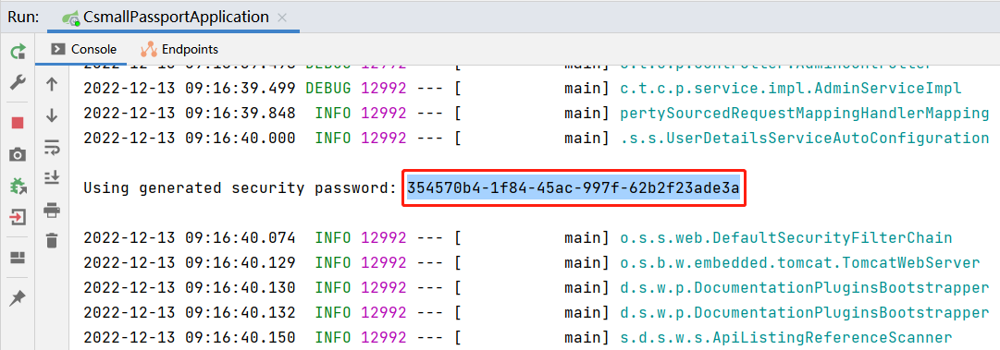
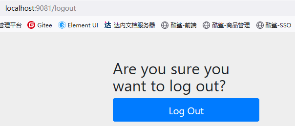
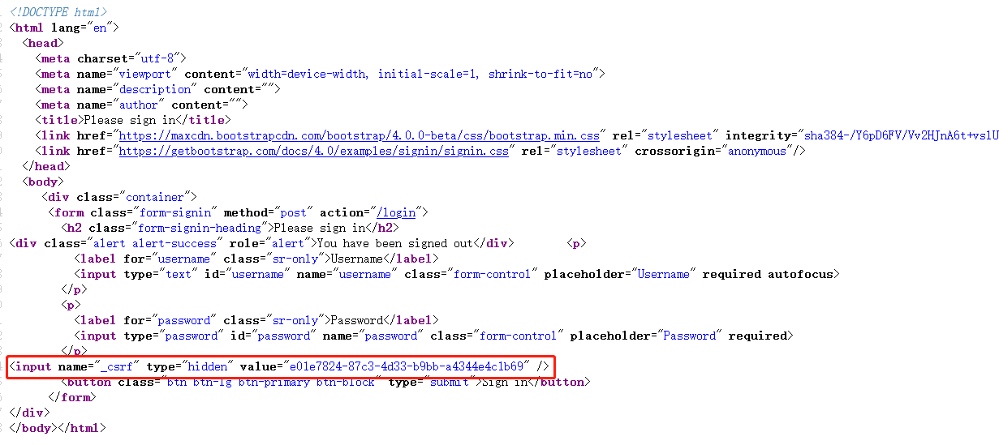
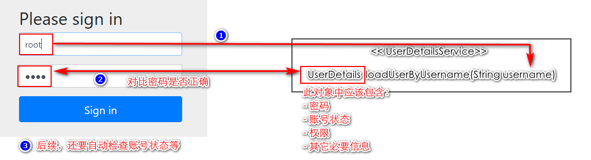

# Spring Security框架

## Spring Security的作用

Spring Security主要解决了**认证**和**授权**相关的问题。

认证（Authenticate）：验证用户身份，即登录。

授权（Authorize）：允许用户访问受保护的资源，即某些请求需要特定的权限，检查用户是否有权限提交这些请求。

## Spring Security的依赖项

在Spring Boot项目中，当需要添加Spring Security的依赖时，依赖项为`spring-boot-starter-security`，即：

```xml
<!-- Spring Boot框架支持Security开发的依赖项，用于实现认证与授权 -->
<dependency>
    <groupId>org.springframework.boot</groupId>
    <artifactId>spring-boot-starter-security</artifactId>
</dependency>
```

**提示：**所有以`spring-boot-starter`为前缀的依赖项基本都有自动配置机制。

当添加以上依赖后，你的项目会发生以下变化：

- 所有请求都变成了**必须登录**的，无论请求路径是否存在，未登录时，都会重定向到`/login`的地址，显示Security提供的登录表单

- Spring Security提供了默认的用户名和密码，用户名为`user`，密码是启用项目时随机生成一个UUID值，在启动日志中可以看到：

  

- 当登录成功后，会重定向到此前尝试访问的页面，**注意：**由于此前尝试访问的页面可能本身就是不存在的，所以登录成功后可能会导致404错误

- 当登录成功后，所有`GET`请求都是允许正常访问的，但是，通过Knife4j的API文档的调试功能测试访问可以发现：所有的`POST`请求都是不允许访问的，访问时会响应`403`错误

- 当登录成功后，可以在浏览器中手动输入URL访问`/logout`路径，此页面是用于退出登录的：

  

  当成功的退出登录后，会重定向到登录页面，此时，回到所有请求都需要登录的状态

## 防止伪造的跨域攻击

默认情况下，即使登录成功，在API文档的调试功能中，所有`POST`请求都不能正常访问，这是因为Spring Security框架默认开启了“防止伪造的跨域攻击”这种防御机制。

伪造的跨域攻击，主要源自服务器端对客户端浏览器的信任，目前，主流的浏览器都是多选项卡的，只要在其中1个选项卡的页面中登录了，在同一个浏览器的其它任何选项卡的页面，都会是已经登录的状态，即使使用的不是多选项卡的浏览器，服务器端信任的也是整个浏览器，这是因为默认的认证机制是基于Session的，浏览器在对同一个服务器端提交请求时会自动携带同样的Session ID，所以，只要登录过，后续再携带同样的Session ID，无论是在哪个选项卡中，都会被视为“已登录”的状态！

基于这样的特点，假设用户在A选项卡中成功的登录某个银行的系统，而B选项卡打开是另一个网站，此网站中隐藏一个向银行发送转账的链接且是自动发出的，由于这2个选项卡是同一个浏览器打开的，所以，B选项卡中的页面发出的请求到了银行系统，银行系统也会视为“已登录”的状态，将执行转账操作。

PS：实际的转账还会有更多检查，例如再次输出密码、要求输出手机接收的验证码，不会如以上例子中直接转账。

Spring Security的防御机制表现为：所有POST请求必须提交某个值，这个值是由客户端向服务器端第一次发送请求时，由服务器端随机生成的，客户端会收到这个值，在后续的访问中，客户端必须提交此值，如果未提交，就会视为“伪造的跨域攻击”，将禁止访问！

例如，在Spring Security默认的登录页中：



由于我们开发的项目是前后端分离的，不可能得到以上这个随机值，所以，发出的`POST`请求全部被视为“伪造的跨域攻击”，所以导致了`403`错误！

在当前项目中，后续会实现基于JWT的认证机制，这种机制本身就是不会出现“伪造的跨域攻击”相关问题的，所以，直接将此防御机制禁用即可！

在项目的根包下创建`config.ScurityConfiguration`配置类，继承自`WebSecurityConfigurerAdapter`类，重写`void configure(HttpSecurity)`方法，在此方法中：

- 不调用父类的方法，即删除通过`super`调用父类方法的语句
  - 删除后，默认情况下，所有的请求都不需要登录了
- 添加`http.csrf().disable();`

## 关于请求是否需要认证

当项目添加了Spring Security的依赖后，所有请求默认都是需要认证（需要成功登录）的，当添加以上配置类，并删除了`super`调用父类方法后，所有请求都不再要求认证了！

在项目中，应该将某些请求配置为需要认证的，还有一些请求是不需要认证的！例如，在线API文档的相关页面应该是不需要认证即可访问的，而管理员管理的相关请求（例如添加管理员、删除管理员等）是需要认证才允许访问的！

则在配置类中的`void configure(HttpSecurity)`方法中添加以下配置：

```java
// 白名单URL
// 注意：所有路径使用 / 作为第1个字符
// 可以使用 * 通配符，例如 /admins/* 可以匹配 /admins/add-new，但是，不能匹配多级，例如不能匹配到 /admins/9527/delete
// 可以使用 ** 通配符，例如 /admins/** 可以匹配若干级，例如可以匹配 /admins/add-new，也可以匹配到 /admins/9527/delete
String[] urls = {
        "/doc.html",
        "/**/*.css",
        "/**/*.js",
        "/favicon.ico",
        "/swagger-resources",
        "/v2/api-docs"
};

// 配置请求是否需要认证
http.authorizeRequests() // 配置请求的认证授权
        .mvcMatchers(urls) // 匹配某些请求路径
        .permitAll() // 允许直接访问，即不需要通过认证
        .anyRequest() // 其它任何请求
        .authenticated(); // 需要是通过认证的
```

**注意：**以上`anyRequest()`其实表示的是“任何请求”或者“所有请求”，并非“其它任何请求”！以上配置的机制是**优先原则**，例如“白名单”中的路径被配置为`permitAll()`，接下来，`anyRequest()`表示的范围其实也包含“白名单”中的所有路径，但是，不会覆盖此前的配置！

## 关于默认的登录页面

Spring Security默认的登录页面也是在`void configure(HttpSecurity)`方法中配置的，默认情况下，父类配置中是开启了登录表单的，如果子类（自定义的配置类继承自`WebSecurityConfigurerAdapter`）中没有通过`super`调用父类的方法，则不会开启登录表单！

在没有开启登录表单的情况下，如果被视为“未认证”，将响应`403`错误。

如果需要开启登录表单，可以在配置方法中添加：

```java
http.formLogin(); // 开启登录表单
```

## 关于`void configure(HttpSecurity)`方法的配置语法

关于请求的安全配置都是在`void configure(HttpSecurity http)`方法中调用参数对象的方法配置的，对于配置不同的内容，可以分开来配置，即使用多条语句，每条语句都调用参数`http`的方法，例如：

```java
// 所有请求都必须是通过认证的
http.authorizeRequests().anyRequest().authenticated();

// 禁用“防止伪造的跨域攻击”这种防御机制
http.csrf().disable();

http.formLogin(); // 开启登录表单
```

这些配置的设计也支持链式语法：

```java
http.authorizeRequests()
        .anyRequest()
        .authenticated()
        .and() // 重点
        .csrf().disable()
        .formLogin();
```

简单来说，如果要使用链式语法，当“打点”后不能调用相关的配置方法，就调用`and()`方法，此方法会返回当前参数对象，即`HttpSecurity`对象，然后继续“打点”进行其它配置。

并且，以上不冲突各配置可以不区分先后顺序。

## 使用自定义的用户名与密码登录

Spring Security在处理认证时，会自动调用`UserDetailsService`接口对象中的`UserDetails loadUserByUsername(String username)`方法，此方法是**根据用户名获取用户详情**的，此方法返回的结果中应该至少包括用户的密码及其它与登录密切相关的信息，例如账号的状态（是否启用等）、账号的权限等。

在整个处理过程中，Spring Security会根据表单中提交的用户名来调用此方法，并获得用户详情，接下来，由Spring Security去判断用户详情中的信息，例如密码是否正确、账号状态是否正常等。



在项目的根包下创建`security.UserDetailsServiceImpl`类，实现`UserDetailsService`接口，添加`@Service`注解，并重写接口中的方法：

```java
package cn.tedu.csmall.passport.security;

import lombok.extern.slf4j.Slf4j;
import org.springframework.security.core.userdetails.User;
import org.springframework.security.core.userdetails.UserDetails;
import org.springframework.security.core.userdetails.UserDetailsService;
import org.springframework.security.core.userdetails.UsernameNotFoundException;
import org.springframework.stereotype.Service;

@Slf4j
@Service
public class UserDetailsServiceImpl implements UserDetailsService {

    @Override
    public UserDetails loadUserByUsername(String s) throws UsernameNotFoundException {
        log.debug("Spring Security调用了loadUserByUsername()方法，参数：{}", s);

        // 假设可用的用户名/密码是 root/1234
        if ("root".equals(s)) {
            UserDetails userDetails = User.builder()
                    .username("root")
                    .password("1234")
                    .disabled(false) // 账号是否禁用
                    .accountLocked(false) // 账号是否已锁定
                    .accountExpired(false) // 账号是否过期
                    .credentialsExpired(false) // 凭证是否过期
                    .authorities("这是一个山寨的临时权限，也不知道有什么用") // 权限
                    .build();
            return userDetails;
        }

        // 如果用户名不存在，暂时返回null
        return null;
    }

}
```

> 提示：以上类必须添加`@Service`注解，由于也在组件扫描的包下，所以，Spring会自动创建此类的对象，后续，Spring Security可以自动从容器中找到此类的对象并使用。

Spring Security在验证密码时，会自动调用密码编码器，则需要配置某个密码编码器，由于以上代码中配置的密码`"1234"`并不是密文，可以暂时使用`NoOpPasswordEncoder`。则在`SecurityConfiguration`中添加：

```java
@Bean
public PasswordEncoder passwordEncoder() {
    return NoOpPasswordEncoder.getInstance(); // NoOpPasswordEncoder是“不加密”的密码编码器
}
```

完成后，再次启用项目，在控制台可以看到Spring Security不再生成随机的UUID密码了，所以，原本的`user`临时账号已经不再可用，必须使用以上类中配置的账号密码才可以登录！

登录效果如下：

- 如果用户名错误，在页面中将提示：`UserDetailsService returned null, which is an interface contract violation`
- 如果用户名正确，但密码错误，在页面中将提示：`用户名或密码错`
- 如果用户名与密码均正确，将重定向到此前访问的页面，并且，在API文档中调试任何功能都是可用的

## 关于密码编码器

Spring Security认为所有的密码都应该是加密的，框架中定义了名为`PasswordEncoder`的接口，接口定义如下：

```java
public interface PasswordEncoder {
    // 执行编码，即：加密
    String encode(CharSequence var1);

    // 匹配密码，参数1是密码原文，参数2是密文，将返回true/false表示密码是否匹配
    boolean matches(CharSequence var1, String var2);

    // 升级编码
    default boolean upgradeEncoding(String encodedPassword) {
        return false;
    }
}
```

无论你认为密码是否需要加密，Spring Security处理认证的过程中，在验证密码是否正确时，都会自动调用此接口对象的`matches()`方法，如果在Spring容器中没有此接口的对象，将无法验证密码。

所以，即使使用没有加密的密码，也需要配置`NoOpPasswordEncoder`。

在Spring Security中，提供了`BCryptPasswordEncoder`类，是`PasswordEncoder`接口的实现类，此类可以用于处理Bcrypt算法的编码、验证密码，推荐使用这种密码编码器，关于`BCryptPasswordEncoder`类的基本使用，测试如下：

```java
package cn.tedu.csmall.passport;

import org.junit.jupiter.api.Test;
import org.springframework.security.crypto.bcrypt.BCryptPasswordEncoder;
import org.springframework.security.crypto.password.PasswordEncoder;

public class BcryptTest {

    PasswordEncoder passwordEncoder = new BCryptPasswordEncoder();

    @Test
    void encode() {
        String rawPassword = "123456";
        System.out.println("原文：" + rawPassword);

        long start = System.currentTimeMillis();
        for (int i = 0; i < 20; i++) {
            String encodedPassword = passwordEncoder.encode(rawPassword);
            System.out.println("密文：" + encodedPassword);
        }
        long end = System.currentTimeMillis();

        System.out.println("耗时：" + (end - start));
    }

    //    原文：123456
    //    密文：$2a$10$XGvx1Y/.B.fSUt2uS3m43OaFkgZCWs.isoLjXw5O1YTbX1QE001x6
    //    密文：$2a$10$m1XBX0V9Jk8sGO.oZVxF5O3nxRQ/bZjKMGuBn.og74ddrvNfkR1YC
    //    密文：$2a$10$65z1UUvAaNHeit4GgMN8auoEx5ZXYBJI9/bG.HYQiS5YgYkqeARlG
    //    密文：$2a$10$CSr3Js2mu1d/LSJiVTrLQ.11STmG9lFZvO4o5zmyTAu8xOlCjwyf6
    //    密文：$2a$10$WYI2xGW5wJCnG7jz6qOXruDPzS6o9tO9IBdbG3eQpPpbCsvOkl1NK
    //    密文：$2a$10$cs4HLJCvqD8PmHYqcANiiuRpXZMy4Pf3ubbG3EIaOZ.TqyDr5iLuu

    @Test
    void matches() {
        String rawPassword = "123456";
        System.out.println("原文：" + rawPassword);

        String encodedPassword = "$2a$10$cs4HLJCvqD8PmHYqcANiiuRpXZMy4Pf3ubbG3EIaOZ.TqyDr5iLuu";
        System.out.println("密文：" + encodedPassword);

        boolean matches = passwordEncoder.matches(rawPassword, encodedPassword);
        System.out.println("匹配结果：" + matches);
    }

}
```

在项目中，使用Bcrypt算法处理密码时，需要将`PasswordEncoder`的实现对象改为`BCryptPasswordEncoder`：

```java
@Bean
public PasswordEncoder passwordEncoder() {
    // return NoOpPasswordEncoder.getInstance(); // NoOpPasswordEncoder是“不加密”的密码编码器
    return new BCryptPasswordEncoder();
}
```

经过以上调整后，在`UserDetailsServiceImpl`中返回的`UserDetails`对象中的密码也必须是BCrypt算法的密文，例如：

```java
// 假设可用的用户名/密码是 root/123456
if ("root".equals(s)) {
    UserDetails userDetails = User.builder()
            .username("root")
        
        	// 		   ↓↓↓↓↓ 调整 
            .password("$2a$10$XGvx1Y/.B.fSUt2uS3m43OaFkgZCWs.isoLjXw5O1YTbX1QE001x6")
        
            .disabled(false) // 账号是否禁用
            .accountLocked(false) // 账号是否已锁定
            .accountExpired(false) // 账号是否过期
            .credentialsExpired(false) // 凭证是否过期
            .authorities("这是一个山寨的临时权限，也不知道有什么用") // 权限
            .build();
    return userDetails;
}
```

## 使用数据库的账号登录

首先，需要在Mapper层实现“根据用户名查询管理员的登录信息”的功能。

在项目的根包下创建`pojo.vo.AdminLoginInfoVO`类：

```java
package cn.tedu.csmall.passport.pojo.vo;

import lombok.Data;

import java.io.Serializable;
import java.time.LocalDateTime;

/**
 * 管理员的登录信息VO类
 *
 * @author java@tedu.cn
 * @version 0.0.1
 */
@Data
public class AdminLoginInfoVO implements Serializable {

    /**
     * 数据id
     */
    private Long id;

    /**
     * 用户名
     */
    private String username;

    /**
     * 密码（密文）
     */
    private String password;

    /**
     * 是否启用，1=启用，0=未启用
     */
    private Integer enable;

}
```

在`AdminMapper.java`接口中声明抽象方法：

```java
/**
 * 根据管理员用户名查询管理登录信息
 * @param username 用户名
 * @return 匹配的登录信息，如果没有匹配的数据，则返回null
 */
AdminLoginInfoVO getLoginInfoByUsername(String username);
```

在`AdminMapper.xml`中配置查询的SQL语句：

```xml
<!-- AdminLoginInfoVO getLoginInfoByUsername(String username); -->
<select id="getLoginInfoByUsername" resultMap="LoginInfoResultMap">
    SELECT
        <include refid="LoginInfoQueryFields"/>
    FROM
        ams_admin
    WHERE
        username=#{username}
</select>

<sql id="LoginInfoQueryFields">
    <if test="true">
        id, username, password, enable
    </if>
</sql>

<resultMap id="LoginInfoResultMap" 
           type="cn.tedu.csmall.passport.pojo.vo.AdminLoginInfoVO">
    <id column="id" property="id"/>
    <result column="username" property="username"/>
    <result column="password" property="password"/>
    <result column="enable" property="enable"/>
</resultMap>
```

在`AdminMapperTests`中编写并执行测试：

```java
@Test
void getLoginInfoByUsername() {
    String username = "root";
    Object queryResult = mapper.getLoginInfoByUsername(username);
    log.debug("根据用户名【{}】查询数据详情完成，查询结果：{}", username, queryResult);
}
```

完成后，调整`UserDetailsServiceImpl`中的具体实现：

```java
@Slf4j
@Service
public class UserDetailsServiceImpl implements UserDetailsService {

    @Autowired
    private AdminMapper adminMapper;

    @Override
    public UserDetails loadUserByUsername(String s) throws UsernameNotFoundException {
        log.debug("Spring Security调用了loadUserByUsername()方法，参数：{}", s);

        AdminLoginInfoVO loginInfo = adminMapper.getLoginInfoByUsername(s);
        log.debug("从数据库查询用户名【{}】匹配的信息，结果：{}", s, loginInfo);

        if (loginInfo == null) {
            return null; // 暂时
        }

        UserDetails userDetails = User.builder()
                .username(loginInfo.getUsername())
                .password(loginInfo.getPassword())
                .disabled(loginInfo.getEnable() == 0)
                .accountLocked(false) // 账号是否已锁定
                .accountExpired(false) // 账号是否过期
                .credentialsExpired(false) // 凭证是否过期
                .authorities("这是一个山寨的临时权限，也不知道有什么用") // 权限
                .build();
        log.debug("即将向Spring Security返回UserDetails对象：{}", userDetails);
        return userDetails;
    }

}
```

## 使用前后端分离的登录

目前，项目中可以通过数据库中的账号信息进行登录，但是，是通过Spring Security提供的登录表单来登录的，这不是前后端分离的做法，`csmall-web-client`无法与此进行交互。

要使得当前服务器端是前后端分离的模式，需要：

- 在`SecurityConfiguration`中重写`authenticationManagerBean()`方法，并在方法上添加`@Bean`注解
- 创建封装了登录信息的DTO类，即`AdminLoginDTO`，此类中应该封装用户名、密码这2个属性
- 在Service层处理登录业务
  - 在`IAdminService`中添加抽象方法
  - 在`AdminServiceImpl`中实现处理登录的业务，通过`AuthenticationManager`对象的`authenticate()`方法，将用户名、密码交给Spring Security框架去执行认证过程
- 在控制器中处理登录请求
  - 在控制器中添加新的方法，用于处理登录请求，具体的处理过程由Service层实现
  - 注意：应该将登录的请求路径配置在“白名单”中
  - 在全局异常处理器中，对登录失败时Spring Security抛出的异常进行处理

在`SecurityConfiguration`中补充：

```java
@Bean
@Override
public AuthenticationManager authenticationManagerBean() throws Exception {
    return super.authenticationManagerBean();
}
```

在根包下创建`pojo.dto.AdminLoginDTO`类：

```java
package cn.tedu.csmall.passport.pojo.dto;

import lombok.Data;

import java.io.Serializable;

/**
 * 管理员登录的DTO类
 *
 * @author java@tedu.cn
 * @version 0.0.1
 */
@Data
public class AdminLoginDTO implements Serializable {

    /**
     * 用户名
     */
    private String username;

    /**
     * 密码（原文）
     */
    private String password;

}
```

在`IAdminService`中添加抽象方法：

```java
/**
 * 管理员登录
 * @param adminLoginDTO 封装了登录参数的对象
 */
void login(AdminLoginDTO adminLoginDTO);
```

在`AdminServiceImpl`中，先自动装配`AuthenticationManager`对象，然后，重写接口中抽象方法，实现登录的业务：

```java
@Autowired
private AuthenticationManager authenticationManager;

@Override
public void login(AdminLoginDTO adminLoginDTO) {
    log.debug("开始处理【管理员登录】的业务，参数：{}", adminLoginDTO);
    // 执行认证
    Authentication authentication = new UsernamePasswordAuthenticationToken(
            adminLoginDTO.getUsername(), adminLoginDTO.getPassword());
    authenticationManager.authenticate(authentication);
    log.debug("认证通过！");
}
```

在`AdminServiceTests`中编写并执行测试：

```java
@Test
void login() {
    AdminLoginDTO adminLoginDTO = new AdminLoginDTO();
    adminLoginDTO.setUsername("wangkejing");
    adminLoginDTO.setPassword("123456");

    try {
        service.login(adminLoginDTO);
    } catch (Throwable e) {
        // 由于不确定Spring Security会抛出什么类型的异常
        // 所以，捕获的是Throwable
        // 并且，在处理时，应该打印信息，以了解什么情况下会出现哪种异常
        e.printStackTrace();
    }
}
```

当测试时使用的用户名是错误的，异常信息如下：

```
org.springframework.security.authentication.InternalAuthenticationServiceException: UserDetailsService returned null, which is an interface contract violation
```

当测试时使用的密码是错误的，异常信息如下：

```
org.springframework.security.authentication.BadCredentialsException: 用户名或密码错误
```

当测试时使用的账号是禁用的（`enable`值为`0`），异常信息如下：

```
org.springframework.security.authentication.DisabledException: 用户已失效
```

接下来，调整控制器层，先在`AdminController`中添加处理请求的方法：

```java
// http://localhost:9081/admins/login
@ApiOperation("管理员登录")
@ApiOperationSupport(order = 50)
@PostMapping("/login")
public JsonResult login(AdminLoginDTO adminLoginDTO) {
    log.debug("开始处理【管理员登录】的请求，参数：{}", adminLoginDTO);
    adminService.login(adminLoginDTO);
    return JsonResult.ok();
}
```

然后，在`SecurityConfiguration`中，将登录的URL添加到白名单中：

```java
String[] urls = {
        "/admins/login", // 新增
        "/doc.html",
        "/**/*.css",
        "/**/*.js",
        "/a.jpg",
        "/favicon.ico",
        "/swagger-resources",
        "/v2/api-docs"
};
```

完成后，还应该对登录失败时Spring Security抛出的异常进行处理，首先，在`ServiceCode`中添加对应的业务状态码的枚举：

```java
public enum ServiceCode {

    OK(20000),
    ERR_BAD_REQUEST(40000),
    /**
     * 【新增】错误：登录失败，用户名或密码错误
     */
    ERR_UNAUTHORIZED(40100),
    /**
     * 【新增】错误：登录失败，账号已经被禁用
     */
    ERR_UNAUTHORIZED_DISABLED(40110),
    ERR_NOT_FOUND(40400),
    ERR_CONFLICT(40900);
    
    // 其它代码
```

然后，在`GlobalExceptionHandler`中处理登录失败时可能抛出的3种异常（参见之前Service层的测试结果）：

```java
@ExceptionHandler
public JsonResult handleInternalAuthenticationServiceException(InternalAuthenticationServiceException e) {
    log.debug("开始处理InternalAuthenticationServiceException");
    String message = "登录失败，用户名不存在！";
    return JsonResult.fail(ServiceCode.ERR_UNAUTHORIZED, message);
}

@ExceptionHandler
public JsonResult handleBadCredentialsException(BadCredentialsException e) {
    log.debug("开始处理BadCredentialsException");
    String message = "登录失败，密码错误！";
    return JsonResult.fail(ServiceCode.ERR_UNAUTHORIZED, message);
}

@ExceptionHandler
public JsonResult handleDisabledException(DisabledException e) {
    log.debug("开始处理DisabledException");
    String message = "登录失败，账号已经被禁用！";
    return JsonResult.fail(ServiceCode.ERR_UNAUTHORIZED_DISABLED, message);
}
```

全部完成后，重启项目，可以通过API文档的调试功能测试访问，无论使用什么样的账号密码，都可以响应匹配的JSON结果。