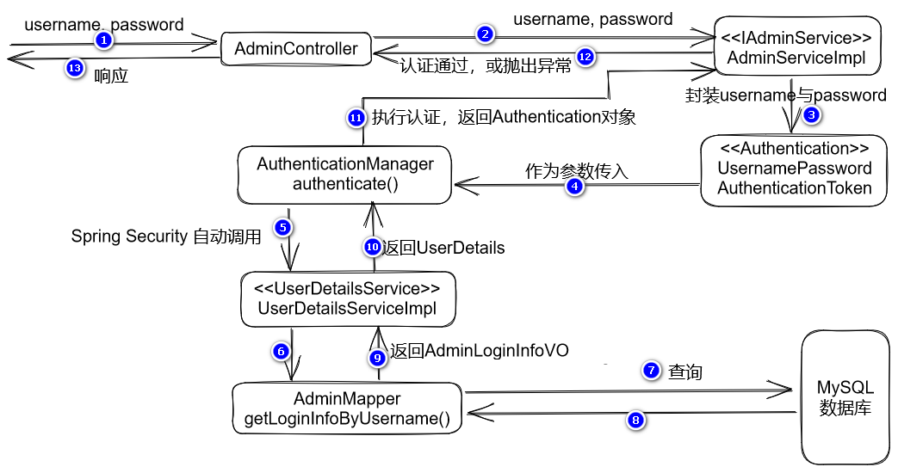

## 关于密码加密

由于目前已经配置了`PasswordEncoder`，具体类型是`BcryptPasswordEncoder`，则Spring Security在处理认证时，会自动使用它，就要求所有的被查询出来的密码都是密文，所以，在添加管理员时，密码也需要使用这种编码进行处理成密文再保存到数据库！

在`AdminServiceImpl`中，先自动装配`PasswordEncoder`对象：

```java
@Autowired
private PasswordEncoder passwordEncoder;
```

然后在`addNew()`方法中，在插入管理员数据之前：

```java
// 将原密码加密
String rawPassword = admin.getPassword();
String encodedPassword = passwordEncoder.encode(rawPassword);
admin.setPassword(encodedPassword);
```

完成后，可以通过`AdminServiceTests`测试检验效果（不要通过在线API文档去访问）。

## 关于处理异常

在处理登录时，是由Spring Security处理的，当登录失败时，会由Spring Security抛出异常，所以，可以统一处理，对于用户名错误、密码错误这种的处理方式可以是完全相同的，但，原本的异常类型并不相同，用户名不存在时抛出的是`InternalAuthenticationServiceException`，密码错误时抛出的是`BadCredentialsException`。

相关异常的继承结构如下：

```
AuthenticationException
  -- BadCredentialsException（密码错误时抛出的异常）
  -- AuthenticationServiceException
    -- InternalAuthenticationServiceException（用户名不存在时抛出的异常）
  -- AccountStatusException
    -- DisabledException（账号被禁用时抛出的异常）
```

为了准确的表达只处理`InternalAuthenticationServiceException`和`BadCredentialsException`这2种异常，可以配置`@ExceptionHandler`注解参数，例如：

```java
@ExceptionHandler({
        InternalAuthenticationServiceException.class,
        BadCredentialsException.class
})
public JsonResult handleAuthenticationException(AuthenticationException e) {
    log.debug("开始处理AuthenticationException");
    log.debug("异常类型：" + e.getClass().getName());
    log.debug("异常消息：" + e.getMessage());
    // log.debug("跟踪信息：");
    // e.printStackTrace();
    String message = "登录失败，用户名或密码错误！";
    return JsonResult.fail(ServiceCode.ERR_UNAUTHORIZED, message);
}
```

另外，建议在全局异常处理器中，添加对`Throwable`异常的处理，避免向客户端响应`500`错误，例如：

```java
@ExceptionHandler
public JsonResult handleThrowable(Throwable e) {
    log.debug("开始处理Throwable");
    e.printStackTrace();
    String message = "服务器忙，请稍后再尝试（开发阶段，请检查服务器端控制台）！";
    // 需要先在ServiceCode中补充新的业务状态码ERR_UNKNOWN，值应该使用比较特殊的
    return JsonResult.fail(ServiceCode.ERR_UNKNOWN, message); 
}
```

**注意：**以上代码中的`e.printStackTrace();`是耗时操作，可能导致线程阻塞，在许多项目中是禁止使用的，在项目上线之前，应该评估是否需要删除此行代码！

## 关于Spring Security判断是否通过认证的标准

在Spring Security框架中，有`SecurityContext`，它是用于持有各用户的认证信息的，即各用户成功登录后，需要将认证信息存入到`SecurityContext`中，后续，Spring Security框架会自动检查`SecurityContext`中的认证信息，如果某个用户在`SecurityContext`中没有匹配的认证信息，将被视为“未通过认证”（未登录）的状态。

在项目的任何代码片段中，都可以通过`SecurityContextHolder`类的静态方法`getContext()`来获取`SecuriytContext`的引用，例如：

```java
SecurityContext securityContext = SecurityContextHolder.getContext();
```

在处理认证的过程中，当视为“已认证”时，需要将认证信息存入到`SecurityContext`中！目前，是通过`AuthenticationManager`对象的`authenticate()`方法执行认证的，此方法认证通过后，会返回`Authentication`对象，即认证信息，将它存入到`SecurityContext`中即可！

则在`AdminServiceImpl`中的`login()`方法中进行调整：

```java
@Override
public void login(AdminLoginDTO adminLoginDTO) {
    log.debug("开始处理【管理员登录】的业务，参数：{}", adminLoginDTO);
    // 执行认证
    Authentication authentication = new UsernamePasswordAuthenticationToken(
            adminLoginDTO.getUsername(), adminLoginDTO.getPassword());
    
    // ↓↓↓↓↓ 调整：获取方法的返回值
    Authentication authenticateResult
            = authenticationManager.authenticate(authentication);
    log.debug("认证通过！");
    
	// ↓↓↓↓↓ 新增以下2行代码
    // 将认证通过后得到的认证信息存入到SecurityContext中
    SecurityContext securityContext = SecurityContextHolder.getContext();
    securityContext.setAuthentication(authenticateResult);
}
```

## 关于管理员（用户）的权限设计

当前项目中，权限使用了 RBAC 的设计原则，具体可参考《CoolShark商城数据库与数据表设计(v1.0)-03.后台管理员管理相关数据表设计.pdf》。

## 实现访问控制

在`csmall_ams.sql`脚本插入中的测试数据中，已经给出了权限、角色、管理员及相关的关联测试数据，也就是说，各管理员账号都有关联的角色，各角色也有关联的权限！

当管理员尝试登录时，应该读取此管理员的权限，最终，存入到`SecurityContext`中，则Spring Security随时可以知道此管理员的权限，并判断是否允许执行某些操作，以实现访问控制！

首先，需要修改Mapper层原有的`getLoginInfoByUsername()`方法的查询，要求查出管理员的权限！需要执行的SQL语句大致是：

```mysql
SELECT
    ams_admin.id,
    ams_admin.username,
    ams_admin.password,
    ams_admin.enable,
    ams_permission.value
FROM ams_admin
LEFT JOIN ams_admin_role ON ams_admin.id=ams_admin_role.admin_id
LEFT JOIN ams_role_permission ON ams_admin_role.role_id=ams_role_permission.role_id
LEFT JOIN ams_permission ON ams_role_permission.permission_id=ams_permission.id
WHERE ams_admin.username='root';
```

在`AdminLoginInfoVO`中添加新的属性，用于表示此管理员的权限：

```java
/**
 * 权限列表
 */
private List<String> permissions;
```

然后，调整`AdminMapper.xml`中配置：

```xml
<!-- AdminLoginInfoVO getLoginInfoByUsername(String username); -->
<select id="getLoginInfoByUsername" resultMap="LoginInfoResultMap">
    SELECT
        <include refid="LoginInfoQueryFields"/>
    FROM
        ams_admin
    LEFT JOIN ams_admin_role ON ams_admin.id=ams_admin_role.admin_id
    LEFT JOIN ams_role_permission ON ams_admin_role.role_id=ams_role_permission.role_id
    LEFT JOIN ams_permission ON ams_role_permission.permission_id=ams_permission.id
    WHERE
        username=#{username}
</select>

<sql id="LoginInfoQueryFields">
    <if test="true">
        ams_admin.id,
        ams_admin.username,
        ams_admin.password,
        ams_admin.enable,
        ams_permission.value
    </if>
</sql>

<!-- collection标签：用于封装List结果，也可理解为1对多的结果，例如1个管理员有多个权限，则权限需要通过此标签来配置 -->
<!-- collection标签的property属性：取值为封装结果中的类的属性名 -->
<!-- collection标签的ofType属性：取值为List集合属性中的元素类型的全限定名，如果是java.lang包下的类，可以不写包名 -->
<!-- collection标签的子级：配置如何创建出ofType的对象，可以通过constructor标签配置简单的对象如何创建，也可以使用id标签和若干个result标签配置较复杂的对象 -->
<!-- 注意：当存在“非单表”查询时，即使column与property的值相同，也必须配置 -->
<resultMap id="LoginInfoResultMap" type="cn.tedu.csmall.passport.pojo.vo.AdminLoginInfoVO">
    <id column="id" property="id"/>
    <result column="username" property="username"/>
    <result column="password" property="password"/>
    <result column="enable" property="enable"/>
    <collection property="permissions" ofType="java.lang.String">
        <constructor>
            <arg column="value"/>
        </constructor>
    </collection>
</resultMap>
```

完成后，可以使用`AdminMapperTests`中原有的测试方法测试访问。

接下来，调整`UserDetailsServiceImpl`中的实现，在向Spring Security返回`UserDetails`之前，向对象中封装查询出来的权限信息：

```java
UserDetails userDetails = User.builder()
    .username(loginInfo.getUsername())
    .password(loginInfo.getPassword())
    .disabled(loginInfo.getEnable() == 0)
    .accountLocked(false)
    .accountExpired(false)
    .credentialsExpired(false)
    .authorities(loginInfo.getPermissions().toArray(new String[]{})) // 调整此行
    .build();
log.debug("即将向Spring Security返回UserDetails对象：{}", userDetails);
```

完成后，重启项目，使用正确的用户名、密码登录状态正常的（未禁用的）账号，在控制台可以看到返回的`UserDetails`信息中包含此账号的权限，例如：

```
2022-12-14 15:03:56.504 DEBUG 3432 --- [nio-9081-exec-2] c.t.c.p.security.UserDetailsServiceImpl  : 
即将向Spring Security返回UserDetails对象：
org.springframework.security.core.userdetails.User [Username=root, Password=[PROTECTED], Enabled=true, AccountNonExpired=true, credentialsNonExpired=true, AccountNonLocked=true, Granted Authorities=[/ams/admin/add-new, /ams/admin/delete, /ams/admin/read, /ams/admin/update, /pms/album/add-new, /pms/album/delete, /pms/album/read, /pms/album/update, /pms/brand/add-new, /pms/brand/delete, /pms/brand/read, /pms/brand/update, /pms/category/add-new, /pms/category/delete, /pms/category/read, /pms/category/update, /pms/picture/add-new, /pms/picture/delete, /pms/picture/read, /pms/picture/update, /pms/product/add-new, /pms/product/delete, /pms/product/read, /pms/product/update]]
```

**注意：**在`AdminServiceImpl`处理登录时，调用的`AuthenticationManager`对象的`authenticate()`方法会返回认证结果，而认证结果中的`Principal`就是`UserDetailsServiceImpl`中返回的`UserDetails`对象！所以，认证结果中是包含权限列表的，在其后，将整个认证结果存入到了`SecurityContext`中（`securityContext.setAuthentication(authenticateResult);`），所以，在`SecurityContext`中是包含了通过认证的账号的权限列表的！

接下来，可以通过Spring Security框架来检查登录的用户是否具有权限发起某些请求！

先在`SecurityConfiguration`类上添加注解，以启用方法级别的安全检查（即权限检查）：

```java
@EnableGlobalMethodSecurity(prePostEnabled = true)
```

然后，在需要检查权限的方法上，使用`@PreAuthroize`注解来配置权限规则，例如在`AdminController`中处理“删除管理员”的请求的方法上配置权限规则：

```java
@PreAuthorize("hasAuthority('/ams/admin/delete')") // 新增
@PostMapping("/{id:[0-9]+}/delete")
public JsonResult delete(@PathVariable Long id) {
    // 暂不关心
}
```

后续，当Spring Security检查到用户无此权限时，将抛出异常，例如：

```
org.springframework.security.access.AccessDeniedException: 不允许访问
```

所以，应该在`ServiceCode`中添加新的业务状态码：

```java
/**
 * 错误：权限不足
 */
ERR_FORBIDDEN(40300),
```

并且，在`GlobalExceptionHandler`中添加处理以上异常的方法（注意：不要导包错误）：

```java
@ExceptionHandler
public JsonResult handleAccessDeniedException(AccessDeniedException e) {
    log.debug("开始处理AccessDeniedException");
    log.debug("异常消息：" + e.getMessage());
    String message = "权限不足，禁止访问！";
    return JsonResult.fail(ServiceCode.ERR_FORBIDDEN, message);
}
```

完成后，启用项目，在数据表中的数据都是初始测试数据的情况下，使用`root`账号登录，可以删除管理员，使用其它账号登录，将因为权限不足而无法执行删除管理员操作。

## 认证处理流程




