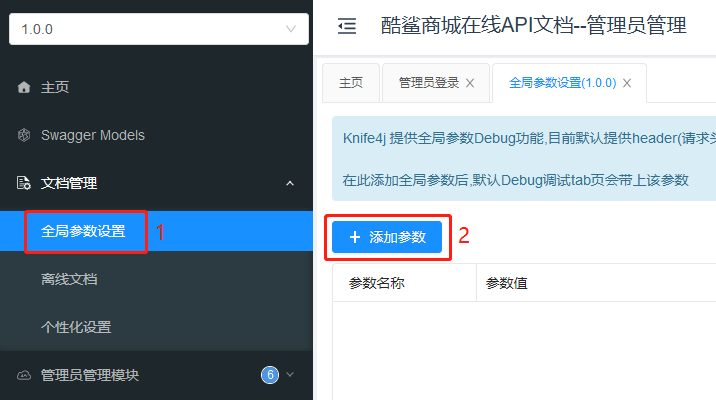

# 在服务器端验证并解析JWT

**【重要】**当客户端成功通过认证（登录成功）后，客户端将得到服务器端响应的JWT，在后续的访问中，**客户端有义务携带JWT**来向服务器端发起请求，如果客户端未携带JWT，即使此前成功通过认证，服务器端也将视为“未通过认证（未登录）”。

**【重要】**服务器端应该尝试接收客户端携带的JWT数据，并尝试解析。

关于客户端携带JWT与服务器端接收JWT，业内惯用的做法是：服务器端会在请求头中名为`Authorization`的属性中获取JWT，则客户端应该按照此标准来提交请求。

在服务器端，应该在接收到任何请求的第一时间，就尝试获取JWT，则可以选用**过滤器（Filter）**来实现此效果。

在项目的根包下创建`filter.JwtAuthorizationFilter`类，继承自`OncePerRequestFilter`类，在类上添加`@Component`注解，并尝试获取JWT：

```java
@Slf4j
@Component
public class JwtAuthorizationFilter extends OncePerRequestFilter {

    @Override
    protected void doFilterInternal(HttpServletRequest request, 
              HttpServletResponse response,
              FilterChain filterChain) throws ServletException, IOException {
        // 尝试从请求头中获取JWT
        String jwt = request.getHeader("Authorization");
        log.debug("尝试从请求头中获取JWT，结果：{}", jwt);
        
        // 放行请求，由后续的组件继续处理
        filterChain.doFilter(request, response);
    }

}
```

为了保证此过滤器能正常参与到Spring Security的处理流程中，需要在`SecurityConfiguration`中自动装配此过滤器的对象：

```java
@Autowired
private JwtAuthorizationFilter jwtAuthorizationFilter;
```

并在`void configure(HttpSecurity http)`方法中，将其添加：

```java
// 将JWT过滤器添加在Spring Security的“用户名密码认证信息过滤器”之前
http.addFilterBefore(jwtAuthorizationFilter, UsernamePasswordAuthenticationFilter.class);

```

在Knife4j的API文档调试功能中，可以携带自定义的请求头数据：




完成后，重启服务器端项目，在API文档的调试中，发起任何请求，都可以在服务器端控制台看到接收到了JWT数据。


